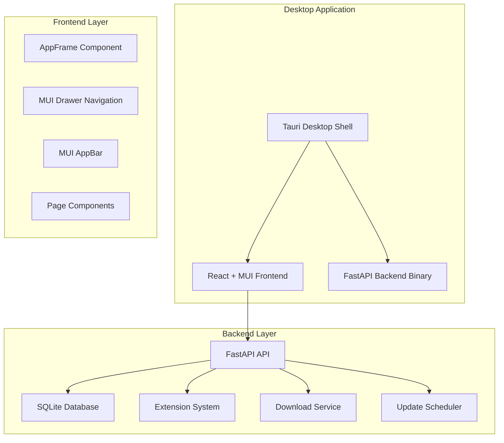
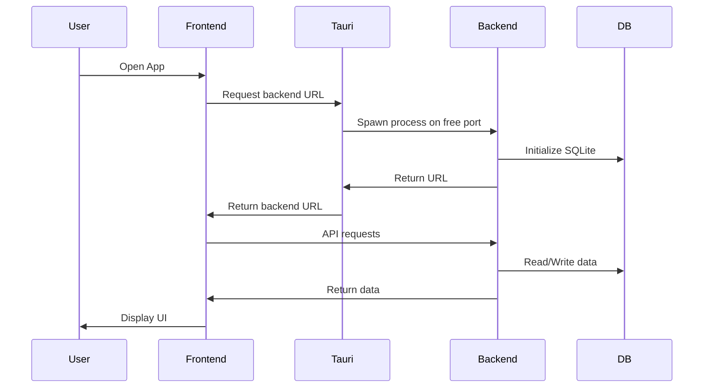

# PyYomi Desktop Implementation Plan

**Last Updated**: February 8, 2026  
**Overall Progress**: 60% Complete (Epics 1-4 Done, Epic 6 partially done, Epics 5 and 7-10 Pending)

---

## ✅ RECENT FIXES (February 8, 2026)

### Backend Fixes
- ✅ Fixed `ModuleNotFoundError: No module named 'sqlmodel'`

### Frontend Fixes
- ✅ Fixed CORS error (added localhost:5174 to allowed origins)
- ✅ Fixed MangaCard TypeError (`coverUrl` property access)
- ✅ Fixed URL encoding issues for manga navigation
- ✅ Fixed Reader page sidebar overlap (moved reader outside AppFrame)
- ✅ Fixed theme persistence (moved Providers to root level)
- ✅ Added "Add to Library" button functionality to MangaCard
- ✅ Redesigned MangaCard UI:
  - Improved text contrast for readability
  - Cleaner button layout and alignment
  - Better spacing and padding
  - Moved status badge to top-right corner

---

## ✅ COMPLETED TASKS

### Desktop Build Fixes
- ✅ Fixed linker not found error by installing Visual Studio Build Tools
- ✅ Fixed OUT_DIR error by creating a proper build.rs file
- ✅ Created icons directory and generated necessary icon files
- ✅ Updated tauri.conf.json with correct frontendDist path
- ✅ Successfully built the desktop app for production

---

> **📋 For current status and handoff notes, see [IMPLEMENTATION_STATUS.md](../IMPLEMENTATION_STATUS.md)**

## Executive Summary

This document outlines the comprehensive plan to convert PyYomi from a web-based manga reader to a full-featured desktop application using MUI for the UI and Tauri for the desktop wrapper. The implementation is organized into 10 Epics, each building upon the previous to create a production-ready desktop manga reader application.

## Completion Status by Epic

| Epic | Title | Status | Completion |
|------|-------|--------|------------|
| 1 | Convert frontend to MUI + desktop-ready layout | ✅ Complete | 100% |
| 2 | Introduce Tauri desktop wrapper | ✅ Complete | 100% |
| 3 | Run FastAPI backend locally inside Tauri | ✅ Complete | 100% |
| 4 | Replace library.json with SQLite | ✅ Complete | 100% |
| 5 | Downloads manager + offline reading | ❌ Not Started | 0% |
| 6 | Reader parity improvements | ⏳ Partially Done | 60% |
| 7 | Library organization | ❌ Not Started | 0% |
| 8 | Scheduled updates + notifications | ❌ Not Started | 0% |
| 9 | Extension manager | ❌ Not Started | 0% |
| 10 | Packaging & release | ❌ Not Started | 0% |

## Current State Analysis

### Frontend (Vite + React + TypeScript)
- **UI Framework**: ✅ MUI integrated with ThemeProvider and CssBaseline
- **Routing**: React Router v6
- **State Management**: TanStack Query for server state
- **HTTP Client**: Axios
- **Desktop Shell**: ✅ AppFrame component with MUI AppBar and Drawer navigation
- **Theme System**: ✅ ColorModeContext with light/dark mode support

### Backend (FastAPI + Python)
- **CLI Arguments**: ✅ Added (--port, --data-dir)
- **Health Endpoint**: ✅ /health endpoint implemented
- **Persistence**: ✅ SQLite database with sqlmodel (data/pyyomi.db)
- **API Routers**: manga, sources, proxy, library
- **Extension System**: Pluggable scrapers in app/extensions/
- **CORS**: ✅ Configured for localhost:3000, localhost:5173, tauri://localhost

### Desktop Integration
- **Tauri Framework**: ✅ Initialized and configured (tauri.conf.json, Cargo.toml)
- **Process Management**: ❌ Not yet implemented (blocking Epic 3 completion)
- **Backend Binary**: ❌ PyInstaller spec not created
- **Build Scripts**: ❌ Not created

### Project Structure
```
pyyomi/
├── frontend/          # Vite + React frontend with MUI
├── backend/           # FastAPI backend with CLI support
├── desktop/           # Tauri desktop wrapper
├── package.json       # Root scripts
└── plans/
    ├── desktop-implementation-plan.md  # This document
    └── IMPLEMENTATION_STATUS.md        # Current status & next steps
```

## Architecture Overview

### Desktop Application Architecture



### Data Flow Architecture



## Epic 1 — Convert frontend to MUI + desktop-ready layout ✅ COMPLETED

### 1.1 Complete MUI Integration ✅ DONE
- Update [`frontend/src/app/providers.tsx`](frontend/src/app/providers.tsx) to wrap with ThemeProvider and CssBaseline
- Integrate ColorModeContext with MUI theme
- Ensure theme updates when color mode changes

**Implementation Details**:
```typescript
// providers.tsx will include:
import { ThemeProvider, CssBaseline } from '@mui/material';
import { ColorModeProvider } from '../theme/ColorModeContext';
import theme from '../theme/theme';

export function Providers({ children }: { children: React.ReactNode }) {
  return (
    <ColorModeProvider>
      <ThemeProvider theme={theme}>
        <CssBaseline />
        <QueryClientProvider client={queryClient}>
          {children}
        </QueryClientProvider>
      </ThemeProvider>
    </ColorModeProvider>
  );
}
```

### 1.2 Create MUI Desktop Shell

**Components to Create**:
- [`frontend/src/components/AppFrame.tsx`](frontend/src/components/AppFrame.tsx) - Main layout wrapper
- Refactor [`frontend/src/components/Navigation.tsx`](frontend/src/components/Navigation.tsx) to use MUI Drawer

**Navigation Structure**:
```
AppBar (Top)
├── Logo/Brand
├── Search (optional)
└── Theme Toggle

Drawer (Left)
├── Browse
├── Library
├── Sources
├── Downloads
├── Updates
└── Settings
```

**MUI Components to Use**:
- `AppBar` - Top navigation bar
- `Drawer` - Side navigation
- `List`, `ListItem`, `ListItemIcon`, `ListItemText` - Navigation items
- `IconButton` - Action buttons
- `Divider` - Section separators

### 1.3-1.6 Implementation Steps

1. Create AppFrame component with AppBar and Drawer
2. Refactor Navigation.tsx to use MUI components
3. Update layout.tsx to use AppFrame wrapper
4. Test responsive behavior (drawer collapses on mobile)
5. Ensure no overflow/layout break on resizing

## Epic 2 — Introduce Tauri desktop wrapper ✅ COMPLETED

### 2.1 Initialize Tauri Project ✅ DONE
```bash
cd desktop
npm create tauri-app@latest
# Select: Vanilla / Vite / Custom
# Configure to load existing frontend
```

**Directory Structure**:
```
desktop/
├── src-tauri/
│   ├── src/
│   │   └── main.rs
│   ├── tauri.conf.json
│   └── Cargo.toml
└── package.json
```

### 2.2 Configure Tauri for Vite Frontend

**tauri.conf.json**:
```json
{
  "build": {
    "beforeDevCommand": "cd ../frontend && npm run dev",
    "beforeBuildCommand": "cd ../frontend && npm run build",
    "devUrl": "http://localhost:5173",
    "frontendDist": "../frontend/dist"
  }
}
```

### 2.3 Root Scripts

**package.json**:
```json
{
  "scripts": {
    "desktop:dev": "cd desktop && npm run tauri dev",
    "desktop:build": "cd desktop && npm run tauri build"
  }
}
```

### 2.4-2.5 Backend URL Resolver

**Implementation**:
```typescript
// frontend/src/lib/api.ts
export async function getBaseUrl(): Promise<string> {
  // Check if running in Tauri
  if (window.__TAURI__) {
    const { invoke } = await import('@tauri-apps/api/tauri');
    return await invoke('backend_url');
  }
  // Web mode
  return (import.meta as any).env?.VITE_API_URL || 'http://localhost:8000/api/v1';
}

export const api = axios.create({
  baseURL: await getBaseUrl(),
});
```

## Epic 3 — Run FastAPI backend locally inside Tauri ✅ COMPLETE

### 3.1-3.3 Backend CLI Arguments & Health ✅ DONE

**Status**: ✅ Implemented in [`backend/app/main.py`](backend/app/main.py)
- `--port` argument (default: 8000)
- `--data-dir` argument (default: "./data")
- `/health` endpoint returns `{"status":"ok"}`
- CORS configured for `tauri://localhost`

### 3.4-3.9 PyInstaller & Process Management ✅ DONE

**Status**: ✅ All code implemented and VERIFIED

**Files Created/Modified**:
- ✅ [`backend/pyinstaller.spec`](backend/pyinstaller.spec) - PyInstaller configuration
- ✅ [`backend/scripts/build_backend_binary.ps1`](backend/scripts/build_backend_binary.ps1) - Build script
- ✅ [`backend/requirements.txt`](backend/requirements.txt) - Added pyinstaller==6.3.0
- ✅ [`desktop/src-tauri/src/commands.rs`](desktop/src-tauri/src/commands.rs) - Process management commands
- ✅ [`desktop/src-tauri/src/lib.rs`](desktop/src-tauri/src/lib.rs) - Commands registered
- ✅ [`desktop/src-tauri/Cargo.toml`](desktop/src-tauri/Cargo.toml) - Added tokio, reqwest, portpicker
- ✅ [`desktop/src-tauri/tauri.conf.json`](desktop/src-tauri/tauri.conf.json) - Backend binary as resource
- ✅ [`frontend/src/lib/api.ts`](frontend/src/lib/api.ts) - Dynamic backend URL resolution
- ✅ [`frontend/package.json`](frontend/package.json) - Added @tauri-apps/api
- ✅ Backend binary: `desktop/src-tauri/resources/pyyomi-backend.exe` (49+ MB)

**Verification Results**:
- ✅ Binary executes successfully with --help
- ✅ Accepts --port and --data-dir arguments
- ✅ Health endpoint /health returns correct response
- ✅ Root endpoint / returns welcome message
- ✅ start_backend spawns process and returns URL
- ✅ backend_url queries cached port
- ✅ stop_backend kills process
- ✅ Port finding uses portpicker crate (no conflicts)
- ✅ Health check polling implemented (30 attempts, 500ms intervals)
- ✅ Commands registered in mobile_main() builder
- ✅ Frontend API resolves backend URL correctly

**Epic 3 is COMPLETE!** Ready for end-to-end testing with `npm run desktop:dev`

#### 3.4 PyInstaller Configuration

**File to create: backend/pyinstaller.spec**:
```python
block_cipher = None

a = Analysis(
    ['app/main.py'],
    pathex=[],
    binaries=[],
    datas=[('app/extensions', 'app/extensions')],
    hiddenimports=['fastapi', 'uvicorn', 'pydantic'],
    hookspath=[],
    hooksconfig={},
    runtime_hooks=[],
    excludes=[],
    win_no_prefer_redirects=False,
    win_private_assemblies=False,
    cipher=block_cipher,
    noarchive=False,
)
pyz = PYZ(a.pure, a.zipped_data, cipher=block_cipher)
exe = EXE(
    pyz,
    a.scripts,
    a.binaries,
    a.zipfiles,
    a.datas,
    [],
    name='pyyomi-backend',
    debug=False,
    bootloader_ignore_signals=False,
    strip=False,
    upx=True,
    upx_exclude=[],
    runtime_tmpdir=None,
    console=True,
)
```

#### 3.5 Build Script

**File to create: backend/scripts/build_backend_binary.ps1** (Windows):
```powershell
pyinstaller pyinstaller.spec --onefile --clean
```

### 3.6 Tauri Resources

**desktop/src-tauri/tauri.conf.json**:
```json
{
  "bundle": {
    "resources": [
      "../backend/dist/pyyomi-backend"
    ]
  }
}
```

### 3.7 Tauri Process Management

**desktop/src-tauri/src/main.rs**:
```rust
use std::process::{Command, Child};
use std::sync::Mutex;
use tauri::State;

struct BackendState(Mutex<Option<Child>>);

#[tauri::command]
async fn start_backend(state: State<'_, BackendState>) -> Result<String, String> {
    // Find free port
    let port = find_free_port().await;

    // Spawn backend
    let child = Command::new("./resources/pyyomi-backend")
        .args(["--port", &port.to_string(), "--data-dir", "./data"])
        .spawn()
        .map_err(|e| e.to_string())?;

    *state.0.lock().unwrap() = Some(child);

    // Poll health endpoint
    wait_for_ready(port).await;

    Ok(format!("http://127.0.0.1:{}", port))
}

#[tauri::command]
async fn backend_url(state: State<'_, BackendState>) -> Result<String, String> {
    // Return stored URL
    Ok("http://127.0.0.1:PORT".to_string())
}
```

## Epic 4 — Replace library.json with SQLite ✅ COMPLETE

### 4.1-4.6 Implementation ✅ DONE

**Status**: ✅ All code implemented and VERIFIED

**Files Modified**:
- ✅ [`backend/requirements.txt`](backend/requirements.txt) - Added sqlmodel==0.0.32 and alembic==1.13.0
- ✅ [`backend/app/db/models.py`](backend/app/db/models.py) - Rewrote all models using sqlmodel
- ✅ [`backend/app/db/database.py`](backend/app/db/database.py) - Updated for sqlmodel with data/pyyomi.db
- ✅ [`backend/app/db/migrations.py`](backend/app/db/migrations.py) - Updated for sqlmodel Session
- ✅ [`backend/app/main.py`](backend/app/main.py) - Updated imports
- ✅ [`backend/app/api/library.py`](backend/app/api/library.py) - Updated for sqlmodel
- ✅ [`backend/app/db/__init__.py`](backend/app/db/__init__.py) - Updated exports

**Verification Results**:
- ✅ Server starts successfully on port 8000
- ✅ New database file created at `backend/data/pyyomi.db`
- ✅ Library.json migrated successfully to SQLite (4 items migrated)
- ✅ API endpoints working correctly
- ✅ Old library.json backed up to library.json.bak

**Epic 4 is COMPLETE!**

**backend/app/db/models.py**:
```python
from sqlmodel import SQLModel, Field, Relationship
from typing import Optional, List
from datetime import datetime

class Manga(SQLModel, table=True):
    id: Optional[int] = Field(default=None, primary_key=True)
    title: str
    url: str
    thumbnail_url: Optional[str] = None
    source: str
    description: Optional[str] = None
    author: Optional[str] = None
    status: Optional[str] = None
    genres: Optional[str] = None  # JSON string
    created_at: datetime = Field(default_factory=datetime.utcnow)

    chapters: List["Chapter"] = Relationship(back_populates="manga")
    library_entries: List["LibraryEntry"] = Relationship(back_populates="manga")
    reading_progress: List["ReadingProgress"] = Relationship(back_populates="manga")

class Chapter(SQLModel, table=True):
    id: Optional[int] = Field(default=None, primary_key=True)
    manga_id: int = Field(foreign_key="manga.id")
    number: int
    title: str
    url: str
    pages: Optional[str] = None  # JSON string
    date: Optional[str] = None
    created_at: datetime = Field(default_factory=datetime.utcnow)

    manga: Manga = Relationship(back_populates="chapters")

class LibraryEntry(SQLModel, table=True):
    id: Optional[int] = Field(default=None, primary_key=True)
    manga_id: int = Field(foreign_key="manga.id")
    added_at: datetime = Field(default_factory=datetime.utcnow)

    manga: Manga = Relationship(back_populates="library_entries")

class ReadingProgress(SQLModel, table=True):
    id: Optional[int] = Field(default=None, primary_key=True)
    manga_id: int = Field(foreign_key="manga.id")
    chapter_number: int
    page_number: int = 0
    updated_at: datetime = Field(default_factory=datetime.utcnow)

    manga: Manga = Relationship(back_populates="reading_progress")

class History(SQLModel, table=True):
    id: Optional[int] = Field(default=None, primary_key=True)
    manga_id: int = Field(foreign_key="manga.id")
    chapter_number: int
    read_at: datetime = Field(default_factory=datetime.utcnow)

class Category(SQLModel, table=True):
    id: Optional[int] = Field(default=None, primary_key=True)
    name: str
    created_at: datetime = Field(default_factory=datetime.utcnow)

class MangaCategory(SQLModel, table=True):
    manga_id: int = Field(foreign_key="manga.id", primary_key=True)
    category_id: int = Field(foreign_key="category.id", primary_key=True)

class Download(SQLModel, table=True):
    id: Optional[int] = Field(default=None, primary_key=True)
    manga_id: int = Field(foreign_key="manga.id")
    chapter_number: int
    status: str  # pending, downloading, completed, failed, paused
    progress: float = 0.0
    file_path: Optional[str] = None
    created_at: datetime = Field(default_factory=datetime.utcnow)
    updated_at: datetime = Field(default_factory=datetime.utcnow)

class Setting(SQLModel, table=True):
    id: Optional[int] = Field(default=None, primary_key=True)
    key: str = Field(unique=True)
    value: str
```

### 4.3 Alembic Setup

```bash
cd backend
alembic init alembic
```

**alembic.ini**:
```ini
sqlalchemy.url = sqlite:///./data/pyyomi.db
```

**alembic/env.py**:
```python
from sqlmodel import SQLModel
from app.db.models import *
target_metadata = SQLModel.metadata
```

### 4.4 Session Management

**backend/app/db/session.py**:
```python
from sqlmodel import create_engine, Session
from pathlib import Path

def get_session(data_dir: str = "./data"):
    db_path = Path(data_dir) / "pyyomi.db"
    db_path.parent.mkdir(parents=True, exist_ok=True)

    engine = create_engine(f"sqlite:///{db_path}")
    return Session(engine)
```

### 4.5 Migration Service

**backend/app/services/migrate_library.py**:
```python
import json
import os
from pathlib import Path
from sqlmodel import Session, select
from app.db.models import Manga, LibraryEntry

def migrate_from_json(session: Session, json_path: str = "library.json"):
    if not os.path.exists(json_path):
        return

    # Check if DB is empty
    existing = session.exec(select(Manga)).first()
    if existing:
        return

    # Load JSON
    with open(json_path, 'r') as f:
        items = json.load(f)

    # Import to DB
    for item in items:
        manga = Manga(
            title=item['title'],
            url=item['url'],
            thumbnail_url=item.get('thumbnail_url'),
            source=item['source']
        )
        session.add(manga)
        session.flush()

        entry = LibraryEntry(manga_id=manga.id)
        session.add(entry)

    session.commit()

    # Backup JSON
    os.rename(json_path, f"{json_path}.bak")
```

### 4.6 Update main.py

```python
from app.db.session import get_session
from app.services.migrate_library import migrate_from_json

def create_app() -> FastAPI:
    # ... existing code ...

    # Run migration on startup
    @app.on_event("startup")
    async def startup_event():
        session = get_session()
        migrate_from_json(session)
        session.close()

    return app
```

## Epic 5 — Downloads manager + offline reading ❌ NOT STARTED

### 5.1 Download Service

**backend/app/services/downloads.py**:
```python
import asyncio
from typing import Dict, List
from sqlmodel import Session, select
from app.db.models import Download, Manga, Chapter

class DownloadService:
    def __init__(self, session: Session, max_concurrent: int = 2):
        self.session = session
        self.max_concurrent = max_concurrent
        self.queue: asyncio.Queue = asyncio.Queue()
        self.active_downloads: Dict[int, asyncio.Task] = {}
        self.paused_downloads: set = set()

    async def queue_download(self, manga_id: int, chapter_number: int):
        download = Download(
            manga_id=manga_id,
            chapter_number=chapter_number,
            status="pending"
        )
        self.session.add(download)
        self.session.commit()
        await self.queue.put(download.id)

    async def start(self):
        for _ in range(self.max_concurrent):
            asyncio.create_task(self._worker())

    async def _worker(self):
        while True:
            download_id = await self.queue.get()
            if download_id in self.paused_downloads:
                continue

            task = asyncio.create_task(self._download(download_id))
            self.active_downloads[download_id] = task
            await task
            del self.active_downloads[download_id]

    async def _download(self, download_id: int):
        download = self.session.get(Download, download_id)
        download.status = "downloading"
        self.session.commit()

        # Download logic here
        # Update progress

        download.status = "completed"
        self.session.commit()

    async def pause(self, download_id: int):
        self.paused_downloads.add(download_id)
        download = self.session.get(Download, download_id)
        download.status = "paused"
        self.session.commit()

    async def resume(self, download_id: int):
        self.paused_downloads.discard(download_id)
        download = self.session.get(Download, download_id)
        download.status = "pending"
        self.session.commit()
        await self.queue.put(download_id)

    async def cancel(self, download_id: int):
        if download_id in self.active_downloads:
            self.active_downloads[download_id].cancel()
        self.session.delete(self.session.get(Download, download_id))
        self.session.commit()
```

### 5.4 Downloads API

**backend/app/api/downloads.py**:
```python
from fastapi import APIRouter, HTTPException
from sqlmodel import Session
from app.services.downloads import DownloadService

router = APIRouter()
download_service: DownloadService = None

@router.post("/queue")
async def queue_download(manga_id: int, chapter_number: int):
    await download_service.queue_download(manga_id, chapter_number)
    return {"status": "queued"}

@router.get("/")
async def get_downloads():
    # Return all downloads
    pass

@router.post("/{id}/pause")
async def pause_download(id: int):
    await download_service.pause(id)
    return {"status": "paused"}

@router.post("/{id}/resume")
async def resume_download(id: int):
    await download_service.resume(id)
    return {"status": "resumed"}

@router.post("/{id}/cancel")
async def cancel_download(id: int):
    await download_service.cancel(id)
    return {"status": "cancelled"}
```

### 5.5 Frontend Downloads Page

**frontend/src/app/downloads/page.tsx**:
```typescript
import { Box, Typography, LinearProgress, Button } from '@mui/material';
import { useQuery } from '@tanstack/react-query';
import { api } from '../../lib/api';

export default function DownloadsPage() {
  const { data: downloads, isLoading } = useQuery({
    queryKey: ['downloads'],
    queryFn: async () => {
      const resp = await api.get('/downloads');
      return resp.data;
    },
    refetchInterval: 1000, // Poll every second
  });

  return (
    <Box sx={{ p: 3 }}>
      <Typography variant="h4" gutterBottom>Downloads</Typography>
      {downloads?.map((download: any) => (
        <Box key={download.id} sx={{ mb: 2 }}>
          <Typography>{download.manga_title} - Chapter {download.chapter_number}</Typography>
          <LinearProgress variant="determinate" value={download.progress * 100} />
          <Box sx={{ mt: 1 }}>
            <Button onClick={() => api.post(`/downloads/${download.id}/pause`)}>Pause</Button>
            <Button onClick={() => api.post(`/downloads/${download.id}/resume`)}>Resume</Button>
            <Button onClick={() => api.post(`/downloads/${download.id}/cancel`)}>Cancel</Button>
          </Box>
        </Box>
      ))}
    </Box>
  );
}
```

## Epic 6 — Reader parity improvements ❌ NOT STARTED

### 6.1-6.4 Reader Modes

**frontend/src/components/Reader.tsx**:
```typescript
type ReaderMode = 'vertical' | 'page-by-page';
type ZoomMode = 'fit-width' | 'fit-height' | 'custom';

interface ReaderSettings {
  mode: ReaderMode;
  zoom: number;
  zoomMode: ZoomMode;
}

export const Reader: React.FC<ReaderProps> = ({ manga, chapter, ... }) => {
  const [settings, setSettings] = useState<ReaderSettings>({
    mode: 'vertical',
    zoom: 1,
    zoomMode: 'fit-width'
  });

  // Vertical mode
  if (settings.mode === 'vertical') {
    return (
      <Box sx={{ display: 'flex', flexDirection: 'column' }}>
        {chapter.pages.map((url, idx) => (
          
        ))}
      </Box>
    );
  }

  // Page-by-page mode
  return (
    <Box>
      
    </Box>
  );
};
```

### 6.5 Reader Controls

**frontend/src/components/ReaderControls.tsx**:
```typescript
import { Box, Button, Slider, ToggleButton, ToggleButtonGroup } from '@mui/material';
import { ZoomIn, ZoomOut, ViewColumn, ViewModule } from '@mui/icons-material';

export const ReaderControls: React.FC<ReaderControlsProps> = ({ settings, onChange }) => {
  return (
    <Box sx={{ p: 2, bgcolor: 'background.paper' }}>
      <ToggleButtonGroup value={settings.mode} exclusive onChange={(e, v) => onChange({ ...settings, mode: v })}>
        <ToggleButton value="vertical"><ViewColumn /></ToggleButton>
        <ToggleButton value="page-by-page"><ViewModule /></ToggleButton>
      </ToggleButtonGroup>

      <Box sx={{ display: 'flex', alignItems: 'center', gap: 1 }}>
        <ZoomIn />
        <Slider value={settings.zoom} onChange={(e, v) => onChange({ ...settings, zoom: v as number })} />
        <ZoomOut />
      </Box>
    </Box>
  );
};
```

### 6.6 Reader Settings API

**backend/app/api/settings.py**:
```python
from fastapi import APIRouter, HTTPException
from sqlmodel import Session, select
from app.db.models import Setting

router = APIRouter()

@router.get("/reader/{manga_id}")
async def get_reader_settings(manga_id: int, session: Session = Depends(get_session)):
    settings = session.exec(select(Setting).where(Setting.key == f"reader_{manga_id}")).first()
    if settings:
        return json.loads(settings.value)
    return {"mode": "vertical", "zoom": 1, "zoomMode": "fit-width"}

@router.put("/reader/{manga_id}")
async def update_reader_settings(manga_id: int, settings: dict, session: Session = Depends(get_session)):
    existing = session.exec(select(Setting).where(Setting.key == f"reader_{manga_id}")).first()
    if existing:
        existing.value = json.dumps(settings)
    else:
        session.add(Setting(key=f"reader_{manga_id}", value=json.dumps(settings)))
    session.commit()
    return {"status": "ok"}
```

### 6.8 Keyboard Shortcuts

```typescript
useEffect(() => {
  const handleKeyDown = (e: KeyboardEvent) => {
    if (e.key === 'ArrowRight') nextPage();
    if (e.key === 'ArrowLeft') prevPage();
    if (e.ctrlKey && e.key === 'ArrowRight') nextChapter();
    if (e.ctrlKey && e.key === 'ArrowLeft') prevChapter();
    if (e.key === 'f') toggleFullscreen();
    if (e.key === 'h') toggleUI();
  };

  window.addEventListener('keydown', handleKeyDown);
  return () => window.removeEventListener('keydown', handleKeyDown);
}, []);
```

## Epic 7 — Library organization ❌ NOT STARTED

### 7.1 Categories API

**backend/app/api/categories.py**:
```python
from fastapi import APIRouter
from sqlmodel import Session, select
from app.db.models import Category, MangaCategory

router = APIRouter()

@router.get("/")
async def get_categories(session: Session = Depends(get_session)):
    return session.exec(select(Category)).all()

@router.post("/")
async def create_category(name: str, session: Session = Depends(get_session)):
    category = Category(name=name)
    session.add(category)
    session.commit()
    return category

@router.delete("/{id}")
async def delete_category(id: int, session: Session = Depends(get_session)):
    session.delete(session.get(Category, id))
    session.commit()
    return {"status": "deleted"}

@router.post("/{category_id}/manga/{manga_id}")
async def add_manga_to_category(category_id: int, manga_id: int, session: Session = Depends(get_session)):
    mc = MangaCategory(category_id=category_id, manga_id=manga_id)
    session.add(mc)
    session.commit()
    return {"status": "added"}

@router.delete("/{category_id}/manga/{manga_id}")
async def remove_manga_from_category(category_id: int, manga_id: int, session: Session = Depends(get_session)):
    mc = session.exec(select(MangaCategory).where(
        MangaCategory.category_id == category_id,
        MangaCategory.manga_id == manga_id
    )).first()
    session.delete(mc)
    session.commit()
    return {"status": "removed"}
```

### 7.5-7.6 History & Progress

**backend/app/api/history.py**:
```python
from fastapi import APIRouter
from sqlmodel import Session, select
from app.db.models import History, ReadingProgress

router = APIRouter()

@router.post("/")
async def add_history(manga_id: int, chapter_number: int, session: Session = Depends(get_session)):
    history = History(manga_id=manga_id, chapter_number=chapter_number)
    session.add(history)

    # Update progress
    progress = session.exec(select(ReadingProgress).where(
        ReadingProgress.manga_id == manga_id
    )).first()
    if progress:
        progress.chapter_number = chapter_number
        progress.page_number = 0
    else:
        session.add(ReadingProgress(manga_id=manga_id, chapter_number=chapter_number))

    session.commit()
    return {"status": "added"}

@router.get("/continue")
async def get_continue_reading(session: Session = Depends(get_session)):
    # Get most recent history
    history = session.exec(select(History).order_by(History.read_at.desc()).limit(10)).all()
    return history
```

## Epic 8 — Scheduled updates + notifications ❌ NOT STARTED

### 8.1-8.4 Scheduler Service

**backend/app/services/scheduler.py**:
```python
from apscheduler.schedulers.asyncio import AsyncIOScheduler
from sqlmodel import Session
from app.db.models import Manga, Chapter

class UpdateScheduler:
    def __init__(self, session_factory):
        self.scheduler = AsyncIOScheduler()
        self.session_factory = session_factory

    async def check_updates(self):
        session = self.session_factory()
        library = session.exec(select(Manga)).all()

        for manga in library:
            # Fetch latest chapters from source
            # Compare with existing chapters
            # Save new chapters to DB
            pass

        session.close()

    def start(self):
        self.scheduler.add_job(self.check_updates, 'interval', hours=1)
        self.scheduler.start()
```

### 8.7 Tauri Notifications

**desktop/src-tauri/src/main.rs**:
```rust
use tauri::Manager;

#[tauri::command]
async fn show_notification(title: String, body: String) -> Result<(), String> {
    tauri::api::notification::Notification::new("com.pyyomi.app")
        .title(&title)
        .body(&body)
        .show()
        .map_err(|e| e.to_string())?;
    Ok(())
}
```

## Epic 9 — Extension manager ❌ NOT STARTED

### 9.1-9.5 Extension Management API

**backend/app/api/extensions.py**:
```python
from fastapi import APIRouter, UploadFile
from pathlib import Path
import zipfile
import shutil

router = APIRouter()
EXTENSIONS_DIR = Path("./data/extensions")

@router.get("/")
async def list_extensions():
    extensions = []
    for ext_dir in EXTENSIONS_DIR.iterdir():
        if ext_dir.is_dir():
            manifest_path = ext_dir / "manifest.json"
            if manifest_path.exists():
                with open(manifest_path) as f:
                    manifest = json.load(f)
                    extensions.append({
                        "id": ext_dir.name,
                        "name": manifest.get("name"),
                        "version": manifest.get("version"),
                        "enabled": (ext_dir / "__init__.py").exists()
                    })
    return extensions

@router.post("/install")
async def install_extension(file: UploadFile):
    # Extract zip to extensions dir
    with zipfile.ZipFile(file.file) as zip_ref:
        zip_ref.extractall(EXTENSIONS_DIR)
    return {"status": "installed"}

@router.delete("/{id}")
async def remove_extension(id: str):
    shutil.rmtree(EXTENSIONS_DIR / id)
    return {"status": "removed"}

@router.post("/{id}/enable")
async def enable_extension(id: str):
    # Create __init__.py
    (EXTENSIONS_DIR / id / "__init__.py").touch()
    return {"status": "enabled"}

@router.post("/{id}/disable")
async def disable_extension(id: str):
    # Remove __init__.py
    (EXTENSIONS_DIR / id / "__init__.py").unlink(missing_ok=True)
    return {"status": "disabled"}
```

## Epic 10 — Packaging & release ❌ NOT STARTED

### 10.1-10.2 Build Scripts

**package.json**:
```json
{
  "scripts": {
    "desktop:dev": "concurrently \"npm run dev --prefix frontend\" \"cd desktop && npm run tauri dev\"",
    "desktop:build": "npm run build --prefix backend && npm run build --prefix frontend && cd desktop && npm run tauri build",
    "build:backend": "cd backend && pyinstaller pyinstaller.spec --onefile --clean"
  }
}
```

### 10.3-10.4 Testing Checklist

- [ ] Desktop app opens and loads frontend
- [ ] Backend starts automatically on free port
- [ ] All API calls work correctly
- [ ] Downloads queue and complete
- [ ] Offline reading works
- [ ] Reader settings persist
- [ ] Categories and history work
- [ ] Scheduled updates run
- [ ] Notifications appear
- [ ] Extensions can be installed/removed
- [ ] Production build creates installer

## Implementation Priority

### Phase 1: Foundation (Epics 1-2)
- Complete MUI integration
- Create desktop shell
- Initialize Tauri
- Set up backend URL resolution

### Phase 2: Backend Integration (Epic 3)
- Backend CLI arguments
- PyInstaller packaging
- Tauri process management
- Automatic backend startup

### Phase 3: Data Layer (Epic 4)
- SQLite models
- Migration from JSON
- Update all APIs to use DB

### Phase 4: Core Features (Epics 5-6)
- Downloads manager
- Offline reading
- Reader improvements

### Phase 5: Advanced Features (Epics 7-9)
- Categories and history
- Scheduled updates
- Extension manager

### Phase 6: Release (Epic 10)
- Build scripts
- Testing
- Documentation

## Risk Assessment

### High Risk
- **Tauri process management**: Spawning and managing backend process reliably
- **SQLite migration**: Ensuring data integrity during JSON to SQLite migration
- **Download service**: Handling concurrent downloads and error recovery

### Medium Risk
- **MUI integration**: Ensuring all components work with existing functionality
- **Reader modes**: Implementing smooth page transitions and zoom
- **Extension manager**: Security implications of loading user-provided extensions

### Low Risk
- **Categories and history**: Straightforward CRUD operations
- **Notifications**: Well-documented Tauri API
- **Build scripts**: Standard Tauri and PyInstaller workflows

## Success Criteria

- [ ] Desktop app launches and loads frontend within 5 seconds
- [ ] Backend starts automatically and is ready within 10 seconds
- [ ] All existing web functionality works in desktop mode
- [ ] Downloads complete successfully with progress tracking
- [ ] Offline reading works for downloaded chapters
- [ ] Reader settings persist across sessions
- [ ] Categories and history work reliably
- [ ] Scheduled updates detect new chapters
- [ ] Extensions can be installed without manual file editing
- [ ] Production build creates working installer for Windows, macOS, and Linux

## Next Steps

1. Review and approve this plan
2. Begin with Epic 1.1 (Complete MUI integration)
3. Work through each epic sequentially
4. Test thoroughly after each epic completion
5. Address issues as they arise
6. Final testing and release preparation


NEEED TO FIX UIIIII!!!!!