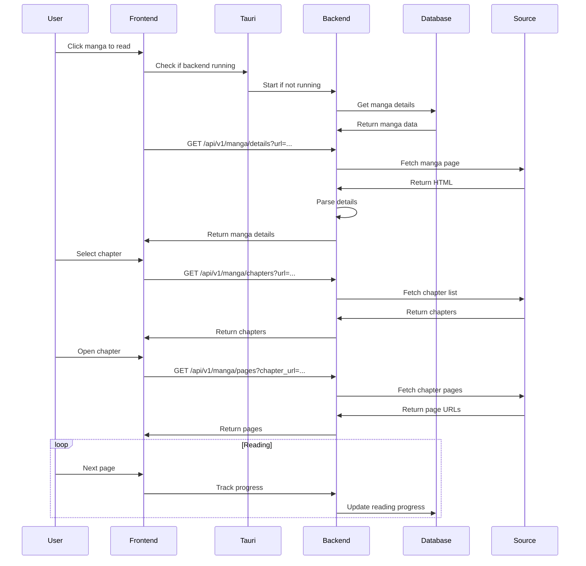
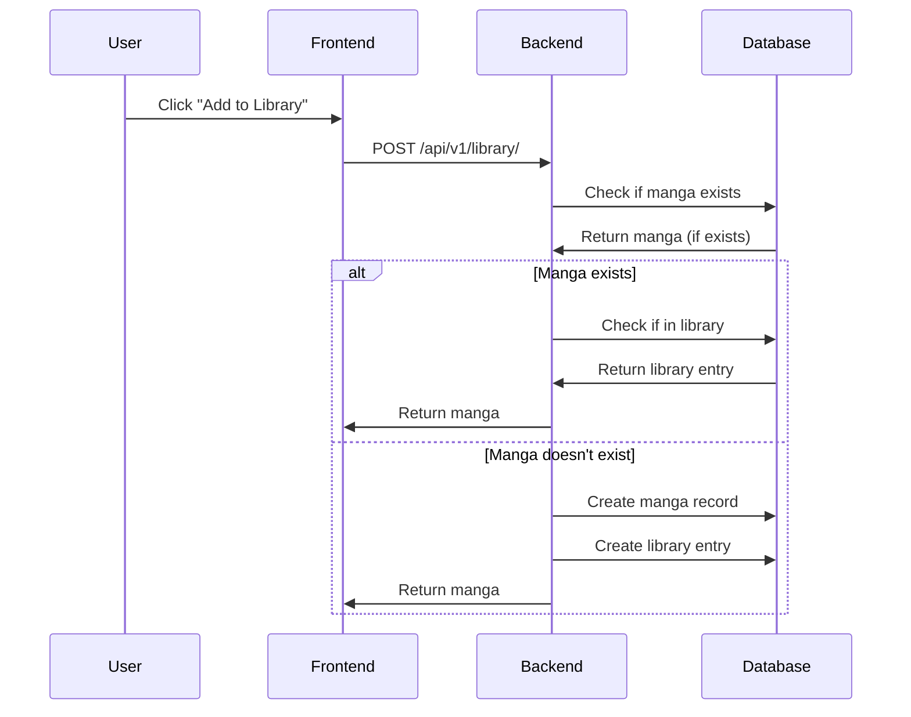

# PyYomi Architecture Documentation

**Last Updated**: February 8, 2026  
**Version**: 1.0.0

---

## Table of Contents

1. [Overview](#overview)
2. [System Architecture](#system-architecture)
3. [Frontend Architecture](#frontend-architecture)
4. [Backend Architecture](#backend-architecture)
5. [Database Schema](#database-schema)
6. [Extension System](#extension-system)
7. [Desktop Integration](#desktop-integration)
8. [API Reference](#api-reference)
9. [Data Flow](#data-flow)
10. [Security Considerations](#security-considerations)

---

## Overview

PyYomi is a cross-platform manga reader application with a modular architecture designed for both web and desktop deployment. The application features a FastAPI backend with async support and a responsive React frontend built with Vite and MUI.

### Key Features

- **Multi-Source Support**: Pluggable extension system for supporting multiple manga sources
- **Library Management**: Save and organize favorite manga with categories
- **Reading Progress Tracking**: Automatically tracks reading progress across sessions
- **Cross-Platform**: Runs on web browsers and desktop (Windows, macOS, Linux)
- **Modern UI**: Responsive Material-UI interface with dark/light theme support
- **Offline Support**: Download chapters for offline reading

---

## System Architecture

```
┌─────────────────────────────────────────────────────────────────┐
│                      PyYomi Application                          │
├─────────────────────────────────────────────────────────────────┤
│                                                                  │
│  ┌─────────────────────┐    ┌─────────────────────┐            │
│  │   Frontend Layer    │    │   Backend Layer     │            │
│  │                     │    │                     │            │
│  │  • React + Vite     │◄──►│  • FastAPI          │            │
│  │  • MUI Components   │    │  • SQLModel/ORM     │            │
│  │  • React Router     │    │  • Extension System │            │
│  │  • TanStack Query   │    │  • Async HTTP       │            │
│  └─────────────────────┘    └─────────────────────┘            │
│                                                                  │
│                            │                                      │
│                            ▼                                      │
│                  ┌─────────────────────┐                         │
│                  │   Database Layer    │                         │
│                  │                     │                         │
│                  │  • SQLite (SQLModel)│                         │
│                  │  • Migration System │                         │
│                  └─────────────────────┘                         │
│                                                                  │
└─────────────────────────────────────────────────────────────────┘

                        Desktop Variant
┌─────────────────────────────────────────────────────────────────┐
│  ┌─────────────────────────────────────────────────────────────┐│
│  │                    Tauri Desktop Shell                      ││
│  │                                                             ││
│  │  ┌─────────────┐    ┌─────────────────────────────────┐   ││
│  │  │  Frontend   │    │  Backend Process (PyInstaller)   │   ││
│  │  │  (WebView)  │◄──►│  • FastAPI Binary               │   ││
│  │  │             │    │  • SQLite Database               │   ││
│  │  └─────────────┘    │  • Extension System             │   ││
│  │                     └─────────────────────────────────┘   ││
│  └─────────────────────────────────────────────────────────────┘│
└─────────────────────────────────────────────────────────────────┘
```

---

## Frontend Architecture

### Technology Stack

| Component | Technology | Purpose |
|-----------|------------|---------|
| Framework | React 18 | UI Library |
| Build Tool | Vite | Development & Production Build |
| Language | TypeScript | Type Safety |
| UI Framework | Material-UI (MUI) v5 | Component Library |
| Routing | React Router v6 | Client-side Routing |
| State Management | TanStack Query | Server State |
| HTTP Client | Axios | API Requests |
| Icons | Lucide React | Icon Set |

### Project Structure

```
frontend/src/
├── app/                    # Next.js-style App Router Pages
│   ├── layout.tsx          # Root layout with Providers
│   ├── providers.tsx       # Context providers (Theme, Query)
│   ├── browse/            # Browse manga page
│   ├── library/           # User library page
│   ├── manga/             # Manga details page
│   ├── reader/            # Manga reader page
│   ├── downloads/         # Downloads management
│   ├── updates/           # Chapter updates
│   ├── settings/          # App settings
│   └── sources/           # Source management
│
├── components/             # Reusable UI Components
│   ├── AppFrame.tsx       # Main layout (AppBar + Drawer)
│   ├── Navigation.tsx     # Navigation sidebar
│   ├── MangaCard.tsx      # Manga card display
│   ├── Reader.tsx         # Manga reader component
│   └── AIChat.tsx         # AI chat feature
│
├── theme/                  # MUI Theme Configuration
│   ├── theme.ts           # MUI theme definition
│   └── ColorModeContext.tsx # Light/dark mode context
│
├── lib/                    # Utilities
│   └── api.ts             # API client with Tauri support
│
├── services/              # Business Logic
│   └── geminiService.ts   # AI Integration
│
└── types.ts              # TypeScript type definitions
```

### Component Hierarchy

```
App
├── Providers (Theme, Query)
│   └── AppFrame
│       ├── AppBar (Top Navigation)
│       │   ├── Menu Button (Mobile)
│       │   ├── Logo/Title
│       │   └── Theme Toggle (Sun/Moon)
│       │
│       ├── Drawer (Side Navigation)
│       │   ├── Browse
│       │   ├── Library
│       │   ├── Sources
│       │   ├── Downloads
│       │   ├── Updates
│       │   └── Settings
│       │
│       └── Main Content Area
│           └── Page Components
│               ├── BrowsePage
│               ├── LibraryPage
│               ├── MangaPage
│               ├── ReaderPage
│               ├── DownloadsPage
│               ├── UpdatesPage
│               ├── SettingsPage
│               └── SourcesPage
```

### Theme System

The application uses MUI's theming system with a custom color mode context:

```typescript
// ColorModeContext.tsx
interface ColorModeContextType {
  mode: 'light' | 'dark';
  toggleColorMode: () => void;
}

// theme.ts
const theme = createTheme({
  palette: {
    mode: 'light', // or 'dark'
    primary: { main: '#1976d2' },
    // ... other palette values
  },
});
```

**Theme Toggle**: A Sun/Moon icon button in the AppBar switches between light and dark modes, with proper contrast handling for both modes.

---

## Backend Architecture

### Technology Stack

| Component | Technology | Purpose |
|-----------|------------|---------|
| Framework | FastAPI | Async API Framework |
| Language | Python 3.10+ | Core Language |
| ORM | SQLModel | Database ORM |
| Database | SQLite | Local Database |
| HTTP Client | HTTPX | Async HTTP Requests |
| HTML Parsing | Beautiful Soup | Web Scraping |
| Validation | Pydantic | Data Validation |

### Project Structure

```
backend/
├── app/
│   ├── main.py              # FastAPI application factory
│   ├── api/                 # API Routers
│   │   ├── library.py       # Library management endpoints
│   │   ├── manga.py         # Manga scraping endpoints
│   │   ├── sources.py       # Source management endpoints
│   │   └── proxy.py         # Image proxy endpoints
│   │
│   ├── db/                  # Database Layer
│   │   ├── models.py        # SQLModel database models
│   │   ├── database.py      # Database connection & session
│   │   ├── migrations.py    # JSON to SQLite migration
│   │   └── __init__.py      # Module exports
│   │
│   └── extensions/           # Extension System
│       ├── base.py          # BaseScraper abstract class
│       ├── loader.py        # Extension registry & loader
│       ├── mangahere/       # MangaHere source implementation
│       └── mangakatana/     # MangaKatana source implementation
│
├── data/                    # Data Directory
│   └── pyyomi.db           # SQLite Database
│
├── requirements.txt         # Python Dependencies
└── pyinstaller.spec         # PyInstaller Configuration
```

### API Endpoints

#### Library API (`/api/v1/library`)

| Method | Endpoint | Description |
|--------|----------|-------------|
| GET | `/` | Get all library manga |
| POST | `/` | Add manga to library |
| DELETE | `/` | Remove manga from library |

#### Manga API (`/api/v1/manga`)

| Method | Endpoint | Description |
|--------|----------|-------------|
| GET | `/search` | Search manga |
| GET | `/popular` | Get popular manga |
| GET | `/latest` | Get latest updates |
| GET | `/details` | Get manga details |
| GET | `/chapters` | Get chapter list |
| GET | `/pages` | Get chapter pages |
| GET | `/filters` | Get source filters |
| GET | `/resolve` | Resolve image URL |

#### Sources API (`/api/v1/sources`)

| Method | Endpoint | Description |
|--------|----------|-------------|
| GET | `/` | List all sources |
| GET | `/{key}` | Get source details |
| POST | `/{key}/activate` | Activate source |

#### Proxy API (`/api/v1`)

| Method | Endpoint | Description |
|--------|----------|-------------|
| GET | `/proxy/image` | Proxy image requests |

---

## Database Schema

### Entity Relationship Diagram

```
┌─────────────────┐       ┌─────────────────┐
│     Manga       │       │    Chapter      │
├─────────────────┤       ├─────────────────┤
│ id (PK)         │◄──────│ id (PK)         │
│ title           │       │ manga_id (FK)   │
│ url (unique)    │       │ chapter_number  │
│ thumbnail_url   │       │ title           │
│ source          │       │ url (unique)    │
│ description     │       │ is_read         │
│ author          │       │ is_downloaded   │
│ artist          │       │ release_date    │
│ genres          │       │ created_at      │
│ status          │       └─────────────────┘
│ last_read_chapter│
│ last_read_at   │
│ created_at      │
│ updated_at      │
└─────────────────┘
         │
         │              ┌─────────────────┐
         └──────────────│ LibraryEntry   │
                        ├─────────────────┤
                        │ id (PK)         │
                        │ manga_id (FK)   │
                        │ added_at        │
                        └─────────────────┘

┌─────────────────┐       ┌─────────────────┐
│ ReadingProgress │       │    History      │
├─────────────────┤       ├─────────────────┤
│ id (PK)         │       │ id (PK)         │
│ manga_id (FK)   │       │ manga_id (FK)   │
│ chapter_number  │       │ chapter_number  │
│ page_number     │       │ read_at         │
│ updated_at      │       └─────────────────┘
└─────────────────┘

┌─────────────────┐       ┌─────────────────┐
│    Category     │       │ MangaCategory   │
├─────────────────┤       ├─────────────────┤
│ id (PK)         │       │ manga_id (FK)   │
│ name            │◄──────│ category_id (FK)│
│ created_at      │       └─────────────────┘
└─────────────────┘

┌─────────────────┐
│    Download     │
├─────────────────┤
│ id (PK)         │
│ manga_id (FK)   │
│ chapter_number  │
│ status          │
│ progress        │
│ file_path       │
│ created_at      │
│ updated_at      │
└─────────────────┘

┌─────────────────┐
│     Setting     │
├─────────────────┤
│ id (PK)         │
│ key (unique)    │
│ value           │
└─────────────────┘
```

### Model Definitions

#### Manga
```python
class Manga(SQLModel, table=True):
    id: Optional[int] = Field(default=None, primary_key=True)
    title: str
    url: str = Field(unique=True, index=True)
    thumbnail_url: Optional[str] = None
    source: str
    description: Optional[str] = None
    author: Optional[str] = None
    artist: Optional[str] = None
    genres: Optional[str] = None
    status: Optional[str] = None
    last_read_chapter: int = 0
    last_read_at: Optional[datetime] = None
    created_at: datetime = Field(default_factory=datetime.utcnow)
    updated_at: datetime = Field(default_factory=datetime.utcnow)

    chapters: List["Chapter"] = Relationship(back_populates="manga")
    library_entries: List["LibraryEntry"] = Relationship(back_populates="manga")
```

#### Chapter
```python
class Chapter(SQLModel, table=True):
    id: Optional[int] = Field(default=None, primary_key=True)
    manga_id: int = Field(foreign_key="manga.id")
    chapter_number: int
    title: Optional[str] = None
    url: str = Field(unique=True, index=True)
    is_read: bool = False
    is_downloaded: bool = False
    downloaded_path: Optional[str] = None
    release_date: Optional[datetime] = None
    created_at: datetime = Field(default_factory=datetime.utcnow)
    updated_at: datetime = Field(default_factory=datetime.utcnow)

    manga: Manga = Relationship(back_populates="chapters")
```

#### LibraryEntry
```python
class LibraryEntry(SQLModel, table=True):
    id: Optional[int] = Field(default=None, primary_key=True)
    manga_id: int = Field(foreign_key="manga.id", unique=True)
    added_at: datetime = Field(default_factory=datetime.utcnow)

    manga: Manga = Relationship(back_populates="library_entries")
```

### Database Session Management

```python
# database.py
from sqlmodel import create_engine, Session
from pathlib import Path
import os

DATA_DIR = os.getenv("DATA_DIR", "./data")
DB_PATH = Path(DATA_DIR) / "pyyomi.db"
DB_PATH.parent.mkdir(parents=True, exist_ok=True)

engine = create_engine(f"sqlite:///{DB_PATH}")

def get_session() -> Session:
    return Session(engine)

def init_db():
    SQLModel.metadata.create_all(bind=engine)
```

---

## Extension System

### Architecture

The extension system uses a registry pattern to load and manage manga source scrapers:

```
┌─────────────────────────────────────────┐
│         Extension Loader                │
│                                        │
│  ┌─────────────────────────────────┐   │
│  │        Registry                 │   │
│  │                                │   │
│  │  • _sources: Dict[str, Scraper] │   │
│  │  • _active_source: str          │   │
│  │                                │   │
│  │  + load_extensions()            │   │
│  │  + get(key)                     │   │
│  │  + activate(key)                │   │
│  └─────────────────────────────────┘   │
└─────────────────────────────────────────┘
                    │
                    ├──► MangaHere Scraper
                    │     • search()
                    │     • popular()
                    │     • latest()
                    │     • details()
                    │     • chapters()
                    │     • pages()
                    │
                    └──► MangaKatana Scraper
                          • search()
                          • popular()
                          • latest()
                          • details()
                          • chapters()
                          • pages()
```

### Base Scraper Class

```python
from abc import ABC, abstractmethod
from dataclasses import dataclass
from typing import List, Optional

@dataclass
class MangaCard:
    title: str
    url: str
    thumbnail_url: Optional[str] = None
    source: str = ""

@dataclass
class MangaDetails:
    title: str
    description: str
    author: Optional[str]
    artist: Optional[str]
    status: str
    genres: List[str]
    thumbnail_url: Optional[str]
    source_url: str

@dataclass
class Chapter:
    title: str
    url: str
    chapter_number: Optional[float] = None
    uploaded_at_ts: Optional[int] = None

class BaseScraper(ABC):
    name: str
    base_urls: List[str]
    language: str = "en"
    version: str = "1.0.0"

    @abstractmethod
    async def search(self, query: str, page: int = 1, filters: List[Filter] = None) -> List[MangaCard]:
        raise NotImplementedError

    @abstractmethod
    async def popular(self, page: int = 1) -> List[MangaCard]:
        raise NotImplementedError

    @abstractmethod
    async def latest(self, page: int = 1) -> List[MangaCard]:
        raise NotImplementedError

    @abstractmethod
    async def details(self, manga_url: str) -> MangaDetails:
        raise NotImplementedError

    @abstractmethod
    async def chapters(self, manga_url: str) -> List[Chapter]:
        raise NotImplementedError

    @abstractmethod
    async def pages(self, chapter_url: str) -> List[str]:
        raise NotImplementedError
```

### Creating a New Extension

1. Create a new directory in `backend/app/extensions/`:
   ```
   backend/app/extensions/mysource/
   ├── __init__.py
   ├── manifest.json
   └── MyScraper.py
   ```

2. Define the manifest:
   ```json
   {
     "id": "mysource",
     "name": "My Source",
     "version": "1.0.0",
     "language": "en"
   }
   ```

3. Implement the scraper:
   ```python
   from app.extensions.base import BaseScraper
   
   class MySourceScraper(BaseScraper):
       name = "My Source"
       base_urls = ["https://example.com"]
       language = "en"
       version = "1.0.0"
       
       async def search(self, query: str, page: int = 1):
           # Implementation
           pass
       # ... other methods
   ```

4. The loader automatically discovers and registers the extension.

---

## Desktop Integration

### Tauri Architecture

```
┌─────────────────────────────────────────────────────────────┐
│                    Tauri Desktop Shell                       │
├─────────────────────────────────────────────────────────────┤
│                                                              │
│  ┌─────────────────────────────────────────────────────┐     │
│  │              Frontend (WebView)                    │     │
│  │                                                      │     │
│  │  • React + MUI Components                           │     │
│  │  • API calls to backend via Tauri commands          │     │
│  │  • Static files served from app resources           │     │
│  └─────────────────────────────────────────────────────┘     │
│                            │                                  │
│                            ▼                                  │
│  ┌─────────────────────────────────────────────────────┐     │
│  │              Tauri Commands (Rust)                   │     │
│  │                                                      │     │
│  │  • start_backend()  - Spawn backend process          │     │
│  │  • backend_url()    - Get backend URL                │     │
│  │  • stop_backend()   - Kill backend process          │     │
│  │  • show_notification() - Show system notification    │     │
│  └─────────────────────────────────────────────────────┘     │
│                            │                                  │
│                            ▼                                  │
│  ┌─────────────────────────────────────────────────────┐     │
│  │              Backend Process                         │     │
│  │   (PyInstaller-bundled FastAPI binary)              │     │
│  │                                                      │     │
│  │  • API Server on dynamic port                       │     │
│  │  • SQLite Database                                  │     │
│  │  • Extension System                                │     │
│  │  • Download Service (future)                        │     │
│  │  • Scheduler Service (future)                        │     │
│  └─────────────────────────────────────────────────────┘     │
│                                                              │
└─────────────────────────────────────────────────────────────┘
```

### Tauri Configuration

**tauri.conf.json**:
```json
{
  "build": {
    "beforeDevCommand": "cd ../frontend && npm run dev",
    "beforeBuildCommand": "cd ../frontend && npm run build",
    "devUrl": "http://localhost:5173",
    "frontendDist": "../frontend/dist"
  },
  "bundle": {
    "resources": [
      "../backend/dist/pyyomi-backend"
    ]
  }
}
```

### Process Management

The Tauri backend manages the FastAPI process lifecycle:

```rust
// commands.rs
#[tauri::command]
async fn start_backend(state: State<'_, BackendState>) -> Result<String, String> {
    let port = find_free_port().await;
    
    let child = Command::new("./resources/pyyomi-backend")
        .args(["--port", &port.to_string(), "--data-dir", "./data"])
        .spawn()
        .map_err(|e| e.to_string())?;

    *state.0.lock().unwrap() = Some(child);

    // Wait for backend to be ready
    wait_for_ready(port).await;

    Ok(format!("http://127.0.0.1:{}", port))
}
```

### Frontend API Resolution

```typescript
// lib/api.ts
export async function getBaseUrl(): Promise<string> {
  if (window.__TAURI__) {
    const { invoke } = await import('@tauri-apps/api/tauri');
    return await invoke('backend_url');
  }
  return (import.meta as any).env?.VITE_API_URL || 'http://localhost:8000/api/v1';
}

export const api = axios.create({
  baseURL: await getBaseUrl(),
});
```

---

## API Reference

### Library API

#### GET /api/v1/library/

Get all manga from the user's library.

**Response**:
```json
[
  {
    "id": 1,
    "title": "Manga Title",
    "url": "https://example.com/manga/1",
    "thumbnail_url": "https://example.com/cover.jpg",
    "source": "mangahere:en",
    "description": "Manga description",
    "author": "Author Name",
    "genres": "Action,Adventure",
    "status": "ongoing",
    "last_read_chapter": 0,
    "created_at": "2026-02-08T14:00:00",
    "updated_at": "2026-02-08T14:00:00"
  }
]
```

#### POST /api/v1/library/

Add manga to the library.

**Request Body**:
```json
{
  "title": "Manga Title",
  "url": "https://example.com/manga/1",
  "thumbnail_url": "https://example.com/cover.jpg",
  "source": "mangahere:en"
}
```

#### DELETE /api/v1/library/

Remove manga from the library.

**Query Parameters**:
- `url`: The manga URL to remove

### Manga API

#### GET /api/v1/manga/search

Search for manga.

**Query Parameters**:
- `q`: Search query (required)
- `page`: Page number (default: 1)
- `source`: Source identifier (optional)

**Response**:
```json
{
  "results": [
    {
      "title": "Manga Title",
      "url": "https://example.com/manga/1",
      "thumbnail_url": "https://example.com/cover.jpg",
      "source": "mangahere:en"
    }
  ],
  "page": 1
}
```

#### GET /api/v1/manga/details

Get detailed manga information.

**Query Parameters**:
- `url`: Manga URL (required)
- `source`: Source identifier (optional)

#### GET /api/v1/manga/chapters

Get chapter list for a manga.

**Query Parameters**:
- `url`: Manga URL (required)
- `source`: Source identifier (optional)

**Response**:
```json
{
  "chapters": [
    {
      "title": "Chapter 1",
      "url": "https://example.com/manga/1/chapter/1",
      "chapter_number": 1,
      "uploaded_at_ts": 1640000000
    }
  ]
}
```

#### GET /api/v1/manga/pages

Get page URLs for a chapter.

**Query Parameters**:
- `chapter_url`: Chapter URL (required)
- `source`: Source identifier (optional)

**Response**:
```json
{
  "pages": [
    "https://example.com/images/1.jpg",
    "https://example.com/images/2.jpg"
  ]
}
```

---

## Data Flow

### Reading a Manga



### Adding to Library



---

## Security Considerations

### CORS Configuration

The backend is configured with CORS to allow requests from trusted origins:

```python
allowed = os.getenv("ALLOWED_ORIGINS", "http://localhost:3000,http://localhost:5173").split(",")
app.add_middleware(
    CORSMiddleware,
    allow_origins=[o.strip() for o in allowed if o.strip()],
    allow_credentials=True,
    allow_methods=["*"],
    allow_headers=["*"],
)
```

### Image Proxy

The proxy API can be used to avoid CORS issues when loading images:

```
GET /api/v1/proxy/image?url=<image_url>
```

### Input Validation

All API inputs are validated using Pydantic models:

```python
class LibraryItem(BaseModel):
    title: str
    url: str
    thumbnail_url: Optional[str] = None
    source: str
```

### SQL Injection Prevention

SQLModel provides built-in protection against SQL injection through parameter binding:

```python
existing_manga = db.exec(select(Manga).where(Manga.url == item.url)).first()
```

---

## Development Setup

### Prerequisites

- **Node.js** 18+
- **Python** 3.10+
- **Git**
- **Rust** (for Tauri development)

### Local Development

1. **Clone the repository**:
   ```bash
   git clone https://github.com/Apex-94/manga-reader-app.git
   cd manga-reader-app
   ```

2. **Set up the backend**:
   ```bash
   cd backend
   python -m venv venv
   # Windows
   venv\Scripts\activate
   # macOS/Linux
   source venv/bin/activate
   
   pip install -r requirements.txt
   uvicorn app.main:create_app --reload
   ```

3. **Set up the frontend**:
   ```bash
   cd frontend
   npm install
   npm run dev
   ```

4. **Access the application**:
   - Frontend: http://localhost:5173
   - Backend API: http://localhost:8000/api/v1

### Docker Deployment

```bash
docker compose up --build
```

### Desktop Development

```bash
# Install Tauri CLI
npm install -g tauri-cli

# Run desktop app
npm run desktop:dev

# Build desktop app
npm run desktop:build
```

---

## File Manifest

### Core Files

| File | Purpose |
|------|---------|
| `frontend/src/main.tsx` | Application entry point |
| `frontend/src/App.tsx` | Root React component |
| `frontend/src/app/layout.tsx` | Root layout with providers |
| `backend/app/main.py` | FastAPI application factory |
| `backend/app/db/models.py` | Database models |
| `backend/app/db/database.py` | Database connection |
| `backend/app/extensions/base.py` | Extension base classes |

### Configuration Files

| File | Purpose |
|------|---------|
| `frontend/vite.config.ts` | Vite configuration |
| `frontend/tsconfig.json` | TypeScript configuration |
| `backend/requirements.txt` | Python dependencies |
| `backend/pyinstaller.spec` | PyInstaller configuration |
| `desktop/src-tauri/tauri.conf.json` | Tauri configuration |
| `desktop/src-tauri/Cargo.toml` | Rust dependencies |

---

## Glossary

| Term | Definition |
|------|------------|
| **Scraper** | A module that extracts data from manga websites |
| **Extension** | A pluggable module that adds support for a manga source |
| **Library** | The user's saved collection of manga |
| **Library Entry** | A reference linking a user to a manga |
| **Reading Progress** | Tracks the user's position in a manga |
| **Source** | A manga website or service |
| **Chapter** | A single installment of a manga |
| **Page** | A single image in a chapter |
| **Tauri** | A framework for building desktop applications |
| **SQLModel** | A Python library combining SQLAlchemy and Pydantic |
| **MUI** | Material-UI React component library |

---

## Changelog

See [CHANGELOG.md](../CHANGELOG.md) for detailed version history.
